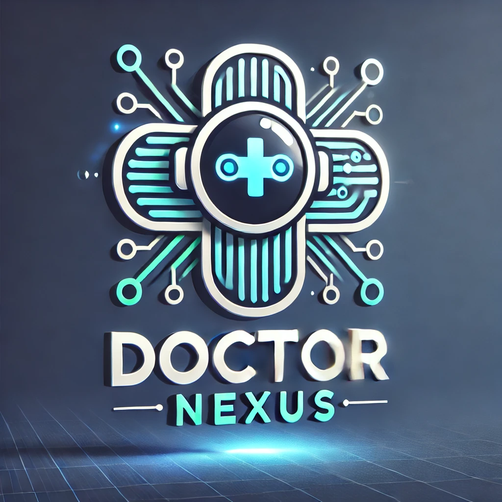

# 💕 AI-HealthCare-Assistant: Dr-Nexus

<div id="top" align="center">
  

<!-- ABOUT THE PROJECT -->

## 📃 About The Project

<b>" Dr. Nexus"</b> an AI-powered virtual healthcare assistant designed to connect patients and medical professionals seamlessly. By leveraging Artificial Intelligence, Machine Learning, and Natural Language Processing, it offers personalized health solutions, symptom analysis, and basic diagnostics through an intuitive interface.
This dynamic system evolves with every interaction, providing instant, reliable health assessments anytime, anywhere. Dr. Nexus empowers users with proactive healthcare tools, reducing the burden on professionals while enabling early diagnosis and timely interventions.
<br>

### 📜 Project Main features

1. **🤖 Symptoms Detection:** using Artificial Intelligence for specialist recommendation and illness detection.
2. **📅 Appointment Scheduling:** based on the nearest doctor to your location or the first available appointment.
3. **📘 Medical Records:** securely stored in the blockchain using smart contracts.
4. **💬 Blogs and Forum:** using machine learning for patient satisfaction prediction.
5. **📈 Real-time reports:** using machine learning to offer an overview of many aspects of the application.
6. **🛒 Paramedical e-shop:** using machine learning for patient's behavioral analysis prediction.
<p align="right">(<a href="#top">back to top</a>)</p>

### 📐 Project Technical Architecture

<div align="center">
  <h1>

</h1>
</div>

<p align="right">(<a href="#top">back to top</a>)</p>

### 🚀 Built With

**Dr-Nexus** is built using MERN Stack technology. You may find below the list of the frameworks/libraries that we used to build our project :
<br/>

  <div align="center">
	
   <a href="https://www.mongodb.com/">
    
    </a>
	
 <a href="https://reactjs.org/">
    
  </a>
	
  <a href="https://nodejs.org/en/">
    
 </a>
  <a href="http://expressjs.com/">
    
    </a>
  
   <a href="https://www.python.org/">
    
  </a>
      <a href="https://flask.palletsprojects.com/en/2.1.x/">
    
  </a>
  </div>
  
<p align="right">(<a href="#top">back to top</a>)</p>

<!-- GETTING STARTED -->

## ✨ Getting Started

To get a local copy up and running follow these simple example steps.

### 🚧 Prerequisites

You may find below the list of things you need to use this project :

- Make sure MongoDB is running on your system.
- You will need to install the "yarn" or "npm" command line.

### 🛠 Installation

_In order to install the app you need to follow the instructions below :_

1. Clone the repo
   ```sh
   git clone https://github.com/kunnub/Dr-Nexus.git
   ```
2. Install NPM packages dependencies

   ```sh
   npm install
   ```

   Or

   ```sh
   yarn install
   ```

3. Run the server on
   ```sh
   npm run development
   ```
4. Open localhost:3000 in the browser and that's it you can enjoy the project 🎉!

<p align="right">(<a href="#top">back to top</a>)</p>

<!-- CONTRIBUTING -->

## 😎 Contributing

If you have a suggestion that would make this project better, please fork the repo and create a pull request. Any contributions you make are **greatly appreciated**.
Don't forget to give the project a star! Thanks again!

1. Fork the Project
2. Create your Feature Branch (`git checkout -b Yourbranch`)
3. Commit your Changes (`git commit -m 'Add some features to project'`)
4. Push to the Branch (`git push origin Yourbranch`)
5. Open a Pull Request

<p align="right">(<a href="#top">back to top</a>)</p>

<!-- CONTACT -->

## 💌 Contact

<b>Project Members:</b>

 <br> **Kunal Verma**  <br> **Kunal Bobde**
| <a href="mailto:kunalverma"></a> <a href="https://github.com/kunalverma45"></a> | <a href="mailto:kunal bobde"></a> <a href="https://github.com/kunnub"></a> |

<p align="right">(<a href="#top">back to top</a>)</p>

<!-- ACKNOWLEDGMENTS --


<!-- MARKDOWN LINKS & IMAGES -->
<!-- https://www.markdownguide.org/basic-syntax/#reference-style-links -->

# Developed with 💕 by **Team-Nexus**.
